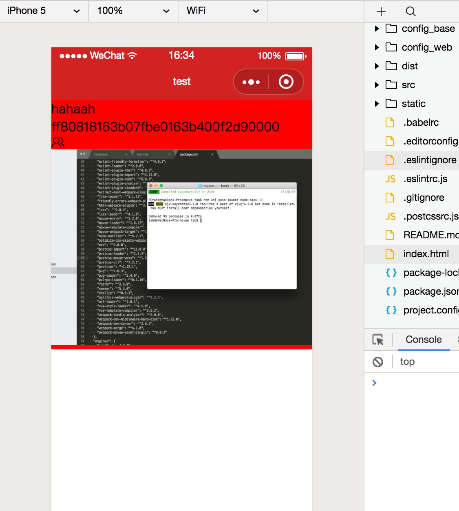
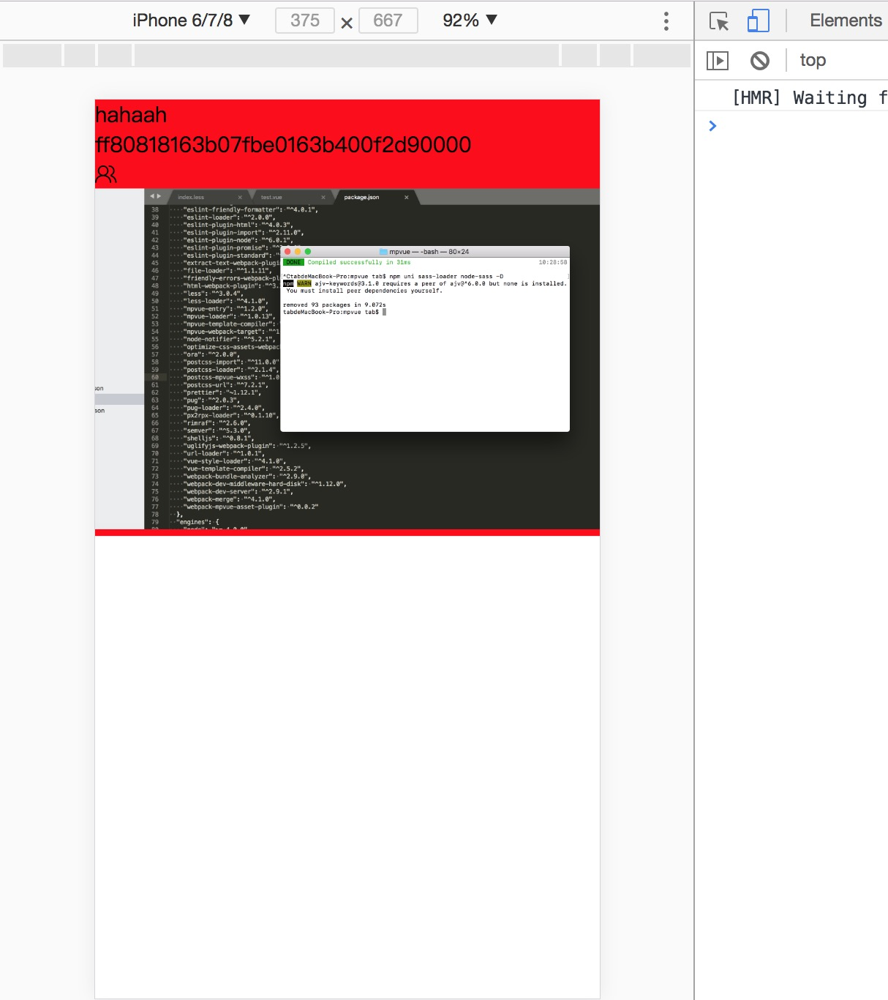

# compatible
🇨🇳A template based on mpvue while satisfying WeChat mini program and h5！Write once and run on the WeChat mini program and web side at the same time！
<br/>基于mpvue的模板，同时满足WeChat mini程序和h5，只写一次，同时运行在微信小程序和web端

## 说明
This project is only to achieve the function, but also need to follow-up optimization. If you are interested in this project, welcome to submit the code, thank you, contribute to the open source.
<br/>
这个项目，只是实现了功能，还需要后续优化，如果您对这个项目感兴趣，欢迎提交代码，谢谢，为开源贡献一份力。
<br/>
在小程序工具跑起来的时候，请改一下Appid

## 截图展示
<p>
  
</p>

## Build Setup

``` bash
# install dependencies
npm i

# serve with hot reload at localhost:3000
npm run dev:web

# build for production with minification
npm run build:web

# serve with hot reload at small app
npm run dev:base

# build for small app production with minification
npm run build:base

```
